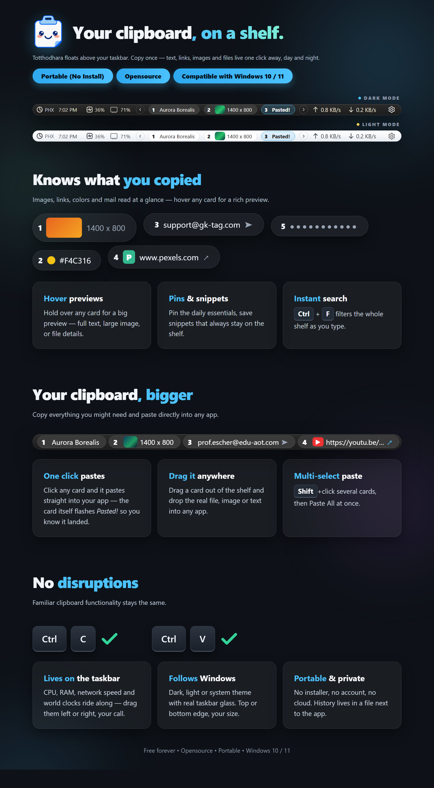

# Totthodhara — Your Clipboard, On a Shelf.

Your clipboard, just bigger!

Totthodhara pins your clipboard history to the taskbar, giving you instant
access to everything you copied — links, images, files, and important text.
No more lost links, screenshots, or passwords.
Save time by copying multiple items at once, no need to switch back and
forth between apps. Click any card to paste it straight into whatever app
you are using, or drag it in.

Totthodhara is free and portable: no installer, no account, no cloud. Your
history lives in a file next to the app, and the shelf follows your Windows
theme from light to dark.



## Download

Grab the latest portable build from
[Releases](https://github.com/hungry-detective/Totthodhara/releases/latest):
unzip anywhere and run `Totthodhara.exe`. Windows 10 / 11.

## Features

- **One-click paste** — click a card and it pastes into your app; the card
  itself flashes *Pasted!* so you know it landed.
- **Everything has a card** — text, links with site icons, images with
  thumbnails, files, colors, mail. Hover any card for a big preview.
- **Multi-select** — `Shift`+click several cards, then Paste All at once.
- **Drag out** — drag a card into any app to drop the real file, image,
  or text.
- **Pins & snippets** — pin daily essentials, save snippets that always
  stay on the shelf.
- **Instant search** — `Ctrl`+`F` filters the whole shelf as you type.
- **Taskbar meters** — CPU, RAM, network speed, and world clocks ride on
  the shelf; drag them left or right.
- **Looks native** — follows the Windows light/dark theme with real
  taskbar glass, top or bottom edge, three sizes.
- **Stays updated** — About checks for new releases and installs them
  with one click, keeping your history and settings.

## For developers

## Layout

```
Totthodhara/
├── CMakeLists.txt        Qt 6.8 / MinGW / Ninja build
├── main.cpp              Minimal entry point, single instance + services
├── Main.qml              Floating shelf bar + tray icon
├── qml/
│   ├── AppState.qml      Settings + theme singleton (ViewModel)
│   ├── ClipStore.qml     Clip list, search, pin/snippet/delete
│   ├── ClipCard.qml      One shelf card (+ right-click menu)
│   ├── SettingRow.qml    Settings card row
│   └── SettingsWindow.qml Appearance/Behavior/Storage/About
├── resources/app.png     Tray + About icon (from the WPF repo)
├── reference/            UI contract copied from the WPF repo
│   ├── MainWindow.xaml / Views/SettingsWindow.xaml
│   ├── Models/ClipboardItem.cs / ViewModels/*.cs
│   └── README.md, AGENTS.md, HOW_TO_BUILD.md
├── build*/               Local Debug/Release builds (ignored later)
└── deploy/               Self-contained Release folder (double-click exe)
```

## Build (needs the global Qt env + a restarted terminal for PATH)

```powershell
cd Totthodhara
cmake -S . -B build -G Ninja -DCMAKE_BUILD_TYPE=Debug "-DCMAKE_PREFIX_PATH=C:/Qt/6.8.3/mingw_64" "-DCMAKE_CXX_COMPILER=C:/Qt/Tools/mingw1310_64/bin/g++.exe"
cmake --build build
```

## Run

* Dev: `build\Totthodhara.exe` (needs Qt on PATH — restart terminal once
  after the environment setup so `C:\Qt\6.8.3\mingw_64\bin` resolves).
* Portable: `deploy\Totthodhara.exe` — runs anywhere, no Qt needed.

## In-app updates (portable only)

* About > Check for updates asks GitHub Releases for the newest tag and
  compares it numerically with the app version (`setApplicationVersion`
  in `main.cpp` — bump this before every release, e.g. `0.2.0`; About
  shows it live via `Qt.application.version`). Repeat checks within an
  hour are answered from `data/update_cache/last_check.json` (no GitHub
  rate-limit burn per launch).
* Repo target lives in `backend/UpdateService.h` (`kUpdateOwner` /
  `kUpdateRepo` — point them at the repo that publishes the releases).
* Publishing a release: run `package.cmd`, create tag `vX.Y.Z`, upload
  `Totthodhara-windows-portable.zip` (made by the script: stub exe +
  `library/`, never `data/`) as a release asset under that EXACT name —
  anything else in the release is ignored, so foreign assets can never
  cross-install into the app. Also upload the
  `Totthodhara-windows-portable.zip.sha256` the script writes beside it:
  the client SHA-256-verifies the zip before installing and refuses
  tampered downloads. Write the notes with a short first line — it becomes
  the one-line headline in About ("What's new" expands the rest).
  Delete superseded old-edition releases so
  `releases/latest` always points at a Qt release.
* Install flow: download to `%TEMP%/Totthodhara-update`, SHA-256 check,
  then hand off to the updater window (`library/TotthodharaUpdater.exe`,
  copied to temp and launched via `run.cmd`, which points PATH + plugins
  at the install's `library/` — plain launches die Qt-less): it waits out
  file locks + mutex with a live progress bar, `Expand-Archive`s the zip,
  backs up stub+library to instant same-volume `.bak` renames, replaces
  everything except `data/` (history.db, clips/, favicons/, settings INI
  all survive), drops the backup, restarts the stub, deletes the stage.
  Any failure restores from backup first. 0.2.0 installs (no updater exe
  yet) fall back to the generated `apply.cmd` console script with the same
  backup/restore guards.
* Guards: refuses to run outside the portable layout (dev trees are never
  wiped); needs HTTPS. No signature verification yet — integrity rests on
  HTTPS + GitHub + the SHA-256 check, releases come from your own repo.

## Defaults (first run looks like a real setup)

Fresh installs open with: System theme, Medium Bottom-Center bar, rounded
corners, near-solid transparent frost, tint pills + borderless thumbs,
always-on-top, auto-paste, hardware left / speed right / clock left in
clock-first order, world clock ON (Phoenix, second clock off), 50 history
items, 25 MB file cap, 2 h file cleaning. Anyone with an existing `data/`
keeps their own settings — stored values always win per-key, defaults only
fill gaps.

## Deploy (refresh after code changes — portable folder, no install needed)

```powershell
.\package.cmd
```

* What it does: kills the app, configures + builds Release, wipes
  `deploy/` **except `data/`**, then lays out the clean portable tree:
  `deploy/Totthodhara.exe` (launcher stub with the app icon — this is what
  friends double-click), `deploy/data/` (untouched: history + settings),
  `deploy/library/` (real exe + Qt DLLs + `Totthodhara/` QML module dir +
  everything `windeployqt --qmldir .` pulls in, incl. QtCore Settings).
* Why the stub: Windows only loads DLLs from beside the exe, so a bare
  exe + subfolder layout cannot start directly. The stub (pure Win32, no
  console, `launcher/stub.cpp`) sets `TOTTHODHARA_DATA_DIR=<root>\data`
  and launches `library\Totthodhara.exe`, forwarding args (`--settings`
  works). `AppPaths::dataDir()` honors that env var, else `<exe>/data`.
* The QML module dir MUST ship next to the real exe (`library/` here) —
  the engine cannot resolve `Main` from resources alone in this setup.
* `deploy/data/` auto-creates on first run (history.db, clips/, favicons/,
  `Totthodhara/Totthodhara.ini`) — never ship it, never delete it here;
  dev `build/` and portable `deploy/` do NOT share data.
* Reinstalling / re-extracting over the old folder keeps the old profile by
  design (history + settings survive updates). Factory reset: quit the app,
  delete `data/`, relaunch. Note: a legacy Roaming profile, if present, is
  imported ONCE into a fresh `data/` — clear that too for a truly empty
  start.
* Icon: `resources/app.ico` is linked into BOTH exes via standalone windres
  calls in CMakeLists (NOT the builtin rule — its injected `-I` flags break
  on paths with spaces). Two targets must never share one `.o` output.

## Shelf behavior (quick reference)

Click = copy back + auto-paste with inline *Pasted!* · `Shift`+click =
multi-select · Paste All · right-click = Pin/Snippet/Delete ·
`Ctrl`+click = instant delete · `Ctrl`+`F` search with live filter ·
gear menu = Clear history / Settings / Exit · tray icon + double-click ·
top/bottom AppBar dock · Light/Dark/System + bar size in Settings.
